# Workforce Management System (WMS)

An enterprise-grade Workforce Management System built with modern technologies for efficient employee management, attendance tracking, leave workflows, project allocation, and reporting.

## 📋 Overview

The WMS is a comprehensive solution designed to streamline HR operations and workforce planning. It provides robust features for managing employees, tracking attendance, processing leave requests, allocating projects, and generating insightful reports.

## 🏗️ Architecture

# Workforce Management System (WMS) - System Design Document

This document provides a comprehensive High-Level Design (HLD) and Low-Level Design (LLD) for the WMS project, detailing the architecture, components, specific feature implementations, and visual diagrams for **every feature**.

---

## 1. High-Level Design (HLD)

### 1.1 Architectural Overview
The WMS is built using a modern, scalable **N-Tier Architecture**.

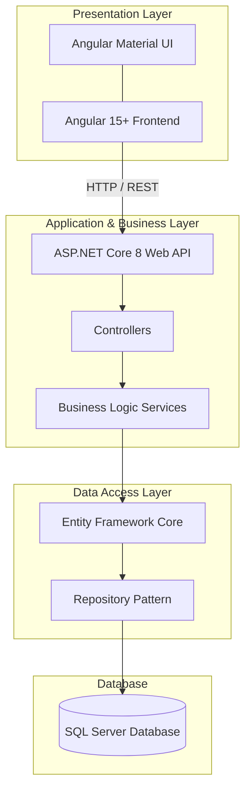

### 1.2 Core Data Model (ERD)

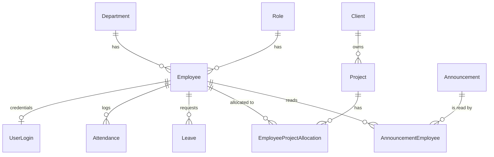

---

## 2. Low-Level Design (LLD) by Feature

### 2.1 Authentication & Authorization
**Goal**: Secure endpoints, manage user sessions, and enforce Role-Based Access Control (RBAC).

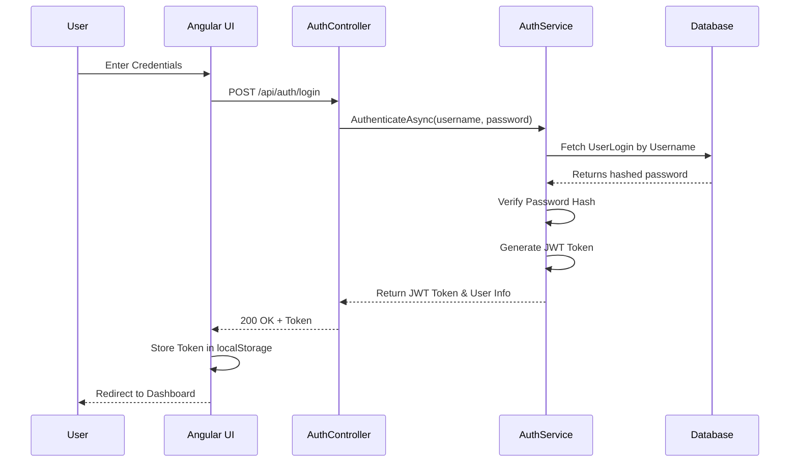

### 2.2 Employee Management
**Goal**: Manage the workforce, their profiles, roles, and status.

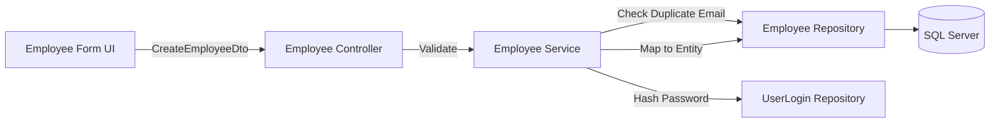

### 2.3 Department Management
**Goal**: Maintain company organizational structures.

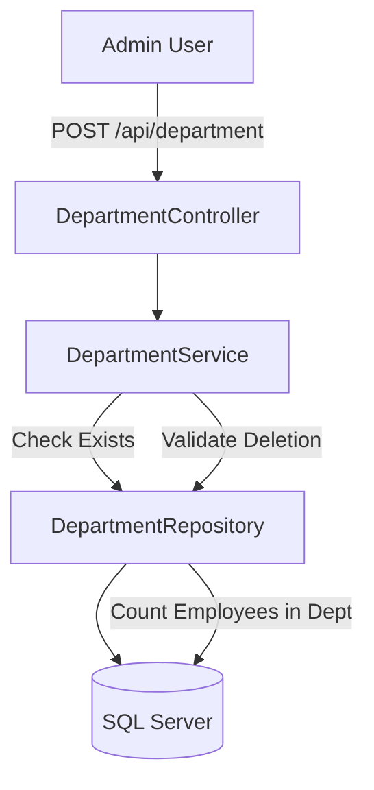

*   **Validation**: Prevents deletion of a department if employees are currently assigned to it (referential integrity).

### 2.4 Client & Project Management
**Goal**: Track external clients, internal/external projects, and allocate employees to projects.

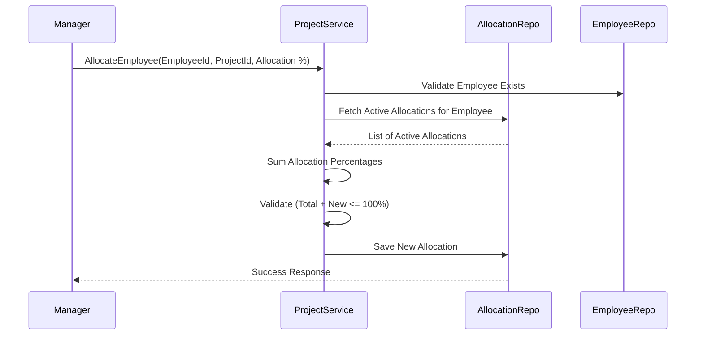

*   **Allocation Logic**: The service includes methods to assign an employee to a project. It explicitly calculates allocation percentages to ensure an employee isn't over-allocated (e.g., > 100% capacity across active projects).

### 2.5 Attendance Tracking
**Goal**: Record daily employee presence and working hours.

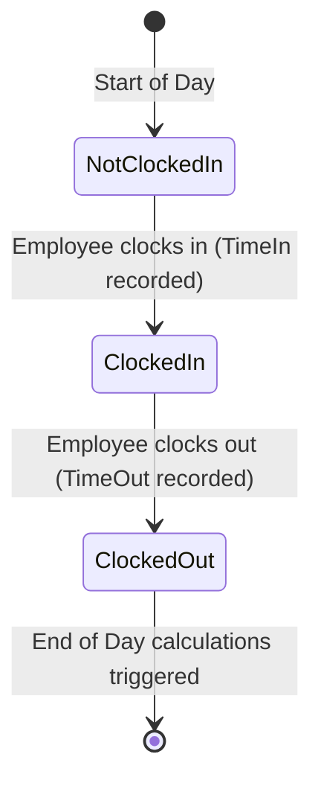

*   **Logic**: Records `TimeIn` and `TimeOut` timestamps. The total hours worked per day can be calculated and aggregated on the dashboard.

### 2.6 Leave Management
**Goal**: Allow employees to request time off and managers to approve/reject.

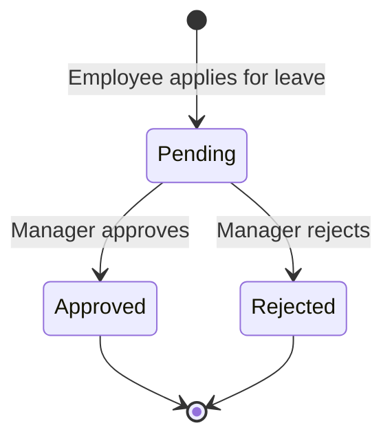

*   **Logic**: Contains validation to prevent users from applying for overlapping leave dates (`HasOverlappingLeaveAsync`). Records `ApproverId` and `ApproverComment`.

### 2.7 Announcements
**Goal**: Broadcast company-wide or targeted messages.

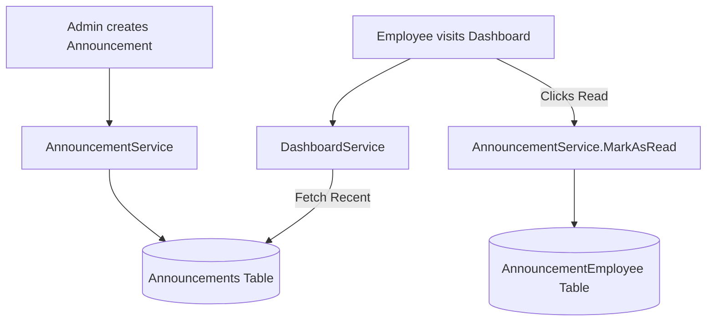

*   **Read Tracking**: When an employee views the dashboard, the system can mark announcements as "Read" by inserting records into `AnnouncementEmployee`.

### 2.8 Audit Logging
**Goal**: Maintain a history of critical system changes for security and compliance.

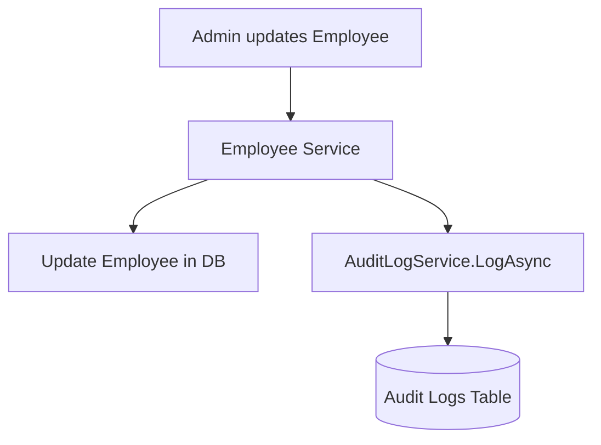

*   **Trigger**: Whenever an entity is created, updated, or deleted, an `AuditLog` record is generated capturing the `Action`, `EntityName`, `EntityId`, and the `PerformedBy` user ID.

### 2.9 Dashboard & Analytics
**Goal**: Provide role-specific KPIs and visual metrics.

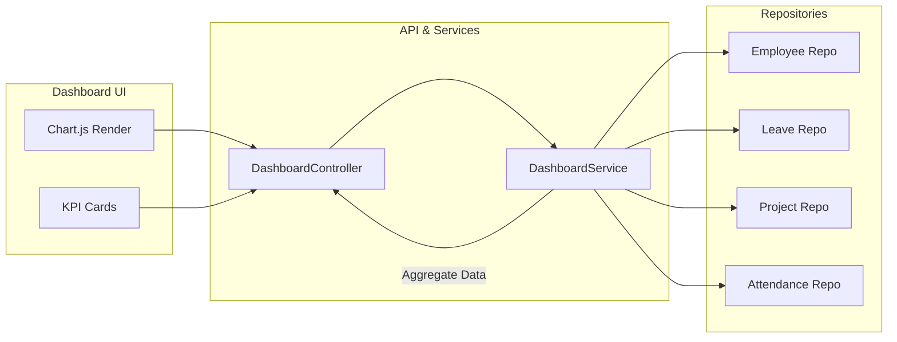

*   **Logic**: Aggregates data across all repositories. Adapts the data payload based on the user's role (Admin vs. Employee).


## 🛠️ Technology Stack

### Backend
- **Framework**: ASP.NET Core 8
- **Database**: SQL Server
- **ORM**: Entity Framework Core (EF Core)
- **Authentication**: JWT (JSON Web Token)
- **Reporting**: Crystal Reports
- **CI/CD**: Azure DevOps

### Frontend
- **Framework**: Angular 18+
- **Package Manager**: npm

## ✨ Key Features

### Employee Management
- Employee profile creation and maintenance
- Organizational hierarchy and role management
- Personal and professional information tracking

### Attendance Tracking
- Real-time attendance marking
- Attendance reports and analytics
- Holiday and shift management

### Leave Management
- Leave request workflows
- Leave approval process
- Leave balance tracking
- Leave policies and rules

### Project Allocation
- Project assignment and tracking
- Resource planning and allocation
- Billable hours tracking

### Access Control
- Role-Based Access Control (RBAC)
- Fine-grained permissions management
- User roles and department hierarchy

### Dashboards & Reports
- Executive dashboards
- Employee analytics
- Crystal Reports integration for detailed reporting
- Real-time data visualization

## 🚀 Getting Started

### Prerequisites
- .NET 8 SDK
- SQL Server (2019 or higher)
- Node.js 18+ and npm
- Angular CLI 18+
- Visual Studio 2022 or VS Code

### Backend Setup

1. **Clone the repository**
   ```bash
   git clone https://github.com/diyagarg819/WMS.git
   cd WMS
   ```

2. **Configure database connection**
   - Update the connection string in `appsettings.json`
   - Connection string format:
     ```
     Server=YOUR_SERVER;Database=WMS;User Id=YOUR_USER;Password=YOUR_PASSWORD;
     ```

3. **Run database migrations**
   ```bash
   dotnet ef database update --project WMS.Infrastructure
   ```

4. **Restore dependencies and build**
   ```bash
   dotnet restore
   dotnet build
   ```

5. **Run the API**
   ```bash
   cd WMS.Api
   dotnet run
   ```
   The API will be available at `https://localhost:5001`

### Frontend Setup

1. **Navigate to frontend directory**
   ```bash
   cd WMS.Frontend
   ```

2. **Install dependencies**
   ```bash
   npm install
   ```

3. **Configure API endpoint**
   - Update the API base URL in `environment.ts` and `environment.prod.ts`

4. **Start development server**
   ```bash
   ng serve
   ```
   Navigate to `http://localhost:4200/`

## 🔐 Authentication

The system uses JWT (JSON Web Token) for authentication:

1. User credentials are validated against the database
2. JWT token is generated upon successful login
3. Token is included in subsequent API requests via Authorization header
4. Token expiration and refresh mechanisms are implemented

## 📊 Database Schema

The system uses SQL Server with Entity Framework Core for data access. Key entities include:

- **Employees** - Employee master data
- **Users** - System users and authentication
- **Roles** - Access control roles
- **Permissions** - Fine-grained permission definitions
- **Departments** - Organizational departments
- **Projects** - Project management
- **Leave Requests** - Leave application workflows
- **Attendance** - Attendance records
- **Holidays** - Company holidays and special days

## 🔄 CI/CD Pipeline

The project uses Azure DevOps for continuous integration and deployment:

- Automated builds on code commits
- Unit and integration test execution
- Code quality analysis
- Automated deployment to staging/production environments

## 🧪 Testing

Run the test suite:

```bash
dotnet test WMS.Tests
```

## 📝 API Documentation

Key API endpoints include:

### Authentication
- `POST /api/auth/login` - User login
- `POST /api/auth/refresh` - Refresh JWT token

### Employees
- `GET /api/employees` - List all employees
- `GET /api/employees/{id}` - Get employee details
- `POST /api/employees` - Create new employee
- `PUT /api/employees/{id}` - Update employee
- `DELETE /api/employees/{id}` - Delete employee

### Attendance
- `GET /api/attendance` - Get attendance records
- `POST /api/attendance/mark` - Mark attendance
- `GET /api/attendance/reports` - Generate attendance reports

### Leave
- `GET /api/leave/requests` - List leave requests
- `POST /api/leave/request` - Submit leave request
- `PUT /api/leave/request/{id}/approve` - Approve leave request

### Projects
- `GET /api/projects` - List projects
- `POST /api/projects/allocate` - Allocate employee to project

## 🤝 Contributing

1. Create a feature branch from `dev`
   ```bash
   git checkout -b feature/feature-name
   ```

2. Make your changes and commit
   ```bash
   git commit -m "Add feature description"
   ```

3. Push to the branch
   ```bash
   git push origin feature/feature-name
   ```

4. Submit a Pull Request to the `dev` branch

## 📋 Development Guidelines

- Follow C# coding standards and conventions
- Write unit tests for new features
- Ensure code passes all tests before submitting PR
- Update documentation for API changes
- Use meaningful commit messages

## 🔧 Configuration

Key configuration files:

- `appsettings.json` - Application settings
- `appsettings.Development.json` - Development-specific settings
- `WMS.Frontend/environment.ts` - Angular development configuration
- `WMS.Frontend/environment.prod.ts` - Angular production configuration

## 📦 Deployment

### Production Build (Backend)
```bash
dotnet publish -c Release
```

### Production Build (Frontend)
```bash
ng build --configuration production
```

## 🐛 Issue Tracking

Report bugs and request features through GitHub Issues.

## 📄 License

Specify your license here.

## 👥 Support & Contact

For questions or support, please contact the development team.

---

**Last Updated**: June 2026  
**Version**: 1.0.0